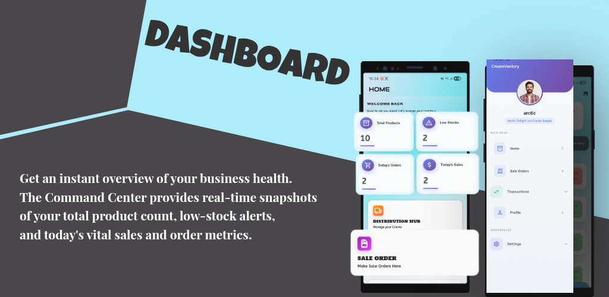
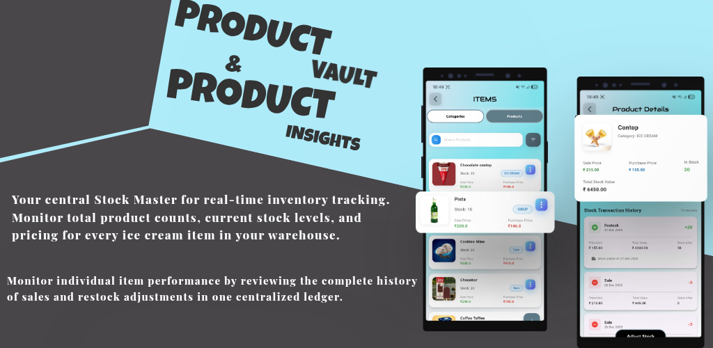
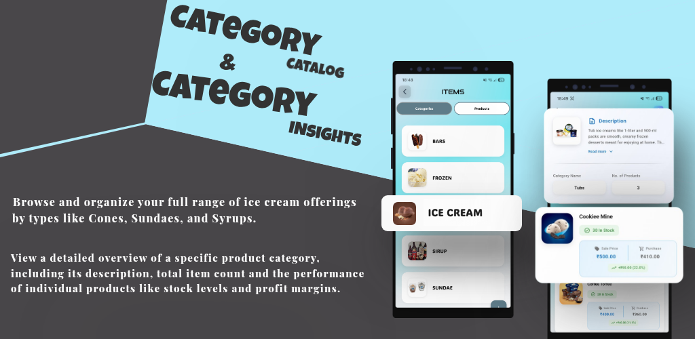
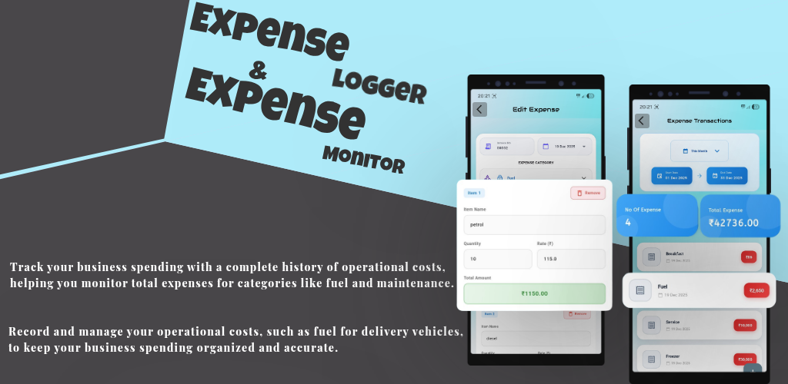
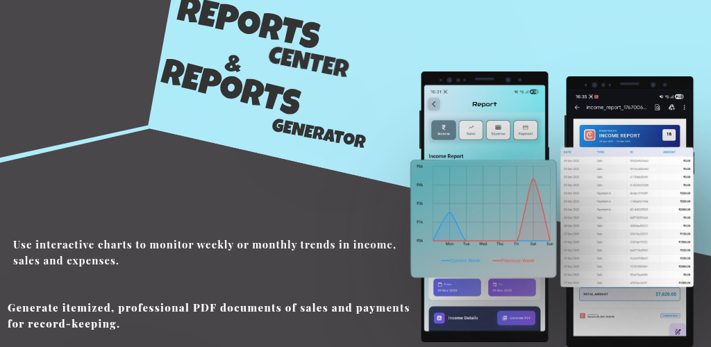

  <!-- App Icon -->
  

  # 🍦 Creamventory
  ### All-in-One Wholesale Inventory, Distribution ERP & Ledger System

  

    A robust, offline-first mobile ERP engineered with Flutter and Hive NoSQL for ice cream distributors, wholesalers, and supply chain merchants. Manage product catalogs, profit margins, client ledgers, advance orders, operational expenses, cash flow, and export itemized PDF reports.
  

  <!-- Badges -->
  

    
    
    
    
    
    
  

  

    <a href="#-overview">Overview</a> •
    <a href="#-visual-showcase--feature-tour">Visual Showcase</a> •
    <a href="#-core-modules-summary">Core Modules</a> •
    <a href="#-tech-stack">Tech Stack</a> •
    <a href="#-project-architecture">Architecture</a> •
    <a href="#-getting-started">Getting Started</a> •
    <a href="#-author">Author</a>
  

---

## 📖 Overview

Operating an ice cream distribution and wholesale supply chain requires balancing high inventory turnover, cold-chain operational expenses, advance pre-orders, dual-entry client credit balances ("You'll Get" / "You'll Give"), and multi-channel payment reconciliation (Cash, PhonePe, GPay).

**Creamventory** is designed as a standalone, offline-first command center. Built with **Flutter** and persistent **Hive NoSQL storage**, the app eliminates dependence on continuous internet connectivity—empowering distributors to perform real-time stock adjustments, bill clients, log van fuel expenses, and generate professional PDF statements on the go with zero latency.

---

## 🎨 Visual Showcase & Feature Tour

### 1. 📊 Executive Dashboard & Command Center
> *Get an instant overview of your business health. The Command Center provides real-time snapshots of your total product count, low-stock alerts, and today's vital sales and order metrics.*

  

- **Real-Time KPI Cards:** Instant metrics for Total Products, Low Stocks, Today's Orders, and Today's Sales.
- **Quick-Access Launchpad:** Direct links to create new sale orders or access client distribution records.
- **Slide Navigation Drawer:** Centralized navigation across inventory, transactions, expenses, reports, and settings.

---

### 2. 🧊 Product Vault & Product Insights
> *Your central Stock Master for real-time inventory tracking. Monitor total product counts, current stock levels, and pricing for every ice cream item in your warehouse. Monitor individual item performance with a complete sales and restock adjustment ledger.*

  

- **Stock Master:** Detailed item cards with stock counts, sale prices, purchase prices, and total holding stock valuation.
- **Granular Stock History:** Complete audit trail logging every restock event (+items) and sale deduction (-items).
- **In-App Stock Adjustments:** Rapid stock correction button to update inventory counts on demand.

---

### 3. 🍦 Category Catalog & Profit Margin Insights
> *Browse and organize your full range of ice cream offerings by types like Cones, Sundaes, and Syrups. View a detailed overview of a specific product category, including description, total item count, stock levels, and profit margins.*

  

- **Categorized Inventory:** Group products into intuitive lines (Bars, Tubs, Cones, Syrups, Sundaes, Frozen treats).
- **Profit Margin Calculation:** Real-time visibility into sale price vs. purchase cost with margin percentages (e.g., `+₹90.00 (22%)`).
- **Category Descriptions:** Rich metadata explaining packaging sizes (e.g., 500ml vs 1L tubs) and product guidelines.

---

### 4. 🚚 Distribution & Party Hub (Client Khata)
> *Track client balances, payments, and outstanding credit for every shop you supply. Detailed breakdown of sales, sales orders, and payment status for individual parties.*

  

- **Net Receivables & Payables:** Real-time totals of outstanding client dues (**You'll Get**) and supplier liabilities (**You'll Give**).
- **Party Profiles:** Complete merchant cards with contact information (email, phone, address) and quick-search filters.
- **Party Transaction Ledger:** Filterable record of previous orders, current balance, and settlement states for each store.

---

### 5. 📝 Sale Order & Fulfillment Pipeline
> *Schedule future sales by logging pre-orders for specific due dates, ensuring your inventory is reserved and ready for delivery when the customer needs it. Manage your distribution workflow in one organized view.*

  

- **Advance Scheduling:** Create pre-orders with auto-generated invoice IDs, customer dropdowns, and target delivery due dates.
- **Itemized Cart Builder:** Seamless item selection with quantity controls and real-time total calculation.
- **Lifecycle Order Tracking:** Filter orders cleanly across `All`, `Open orders`, `Closed orders`, and `Cancelled orders`.

---

### 6. ⛽ Expense Logger & Operational Cost Monitor
> *Track your business spending with a complete history of operational costs, helping you monitor total expenses for categories like fuel and vehicle maintenance to keep your business spending organized and accurate.*

  

- **Multi-Category Expenses:** Tag expenses to essential operational categories (Fuel/Petrol for delivery vans, Deep Freezer maintenance, Vehicle servicing, Daily logistics).
- **Unit Rate & Quantity Calculator:** Log rate and quantity (e.g., 10L petrol @ ₹115/L) with automatic sum calculations.
- **Expense Monitor:** Monthly expense totals, entry counts, and date-filtered expense transaction history.

---

### 7. 💸 Payout & Collections History Tracker
> *Manage and review all outgoing payments made to clients or suppliers, tracking total amounts paid and transaction methods like PhonePe, GPay, or Cash. Monitor all incoming payments from clients with detailed history.*

  

- **Payment-In (Collections):** Log customer receivables with payment mode tags (PhonePe, Google Pay, Cash) and transaction reference IDs.
- **Payment-Out (Payouts):** Track settlements paid out to suppliers or return refunds.
- **Monthly Summary Cards:** Instant tallies for "No. of Payments" and "Total Payment In / Out".

---

### 8. 📈 Reports Center & PDF Generator
> *Use interactive charts to monitor weekly or monthly trends in income, sales, and expenses. Generate itemized, professional PDF documents of sales and payments for record-keeping.*

  

- **Trend Analytics:** Interactive line charts comparing performance curves (e.g., Current Week vs. Previous Week) across days of the week.
- **Flexible Reporting:** Switch between Income, Sales, Expense, and Payment reports with custom date pickers.
- **Itemized PDF Documents:** One-tap export to clean, printable PDF statements formatted with date, transaction type, reference ID, and grand totals.

---

### 9. 🔐 Business Account & Security Settings
> *This page provides a quick overview of your business profile, distribution company details, and a summary of your inventory's health. Update your password here to keep your business data and client information safe.*

  

- **Financial Health Summary:** High-level overview of Total Income, Total Expenses, and Net Balance ("You Will Get" vs "You Will Give").
- **Brand Profile:** Custom company branding (e.g., *Arctic Delight Ice Cream Supply*) and support email.
- **Security & Password Update:** Password change flow with match validation and built-in security recommendations.

---

## ⚡ Core Modules Summary

| Module | Core Functionality |
| :--- | :--- |
| 🍦 **Product & Vault** | Real-time stock levels, purchase & sale prices, stock value computation, and itemized adjustment logs. |
| 🏷️ **Catalog & Margins** | Category segmentation, product descriptions, profit margin percentages, and bulk inventory views. |
| 🤝 **Distribution & Parties** | Client khata balance tracking ("You'll Get" / "You'll Give"), shop contact details, and client order histories. |
| 📋 **Sale Orders** | Advance pre-order booking with delivery due dates, cart builder, and multi-state order status monitor. |
| ⛽ **Expense Logger** | Cold-chain logistics tracking, vehicle fuel, freezer repair costs, and category-wise spending summaries. |
| 💳 **Cash & Collections** | Detailed Payment-In and Payment-Out logs with PhonePe, GPay, and Cash transaction tags. |
| 📊 **Analytics & PDF Export** | Multi-week trend charts, custom date filters, and exportable, print-ready PDF statements. |
| ⚡ **Offline-First Storage** | Lightning-fast Hive NoSQL storage with binary serialization — zero latency and full offline autonomy. |

---

## 🛠️ Tech Stack

- **UI Framework:** [Flutter](https://flutter.dev/) (Channel Stable, Material Design 3)
- **Language:** [Dart](https://dart.dev/)
- **Local Persistence:** [Hive](https://pub.dev/packages/hive) & [hive_flutter](https://pub.dev/packages/hive_flutter) (NoSQL)
- **Code Generation:** [build_runner](https://pub.dev/packages/build_runner) & [hive_generator](https://pub.dev/packages/hive_generator)
- **PDF & Printing:** [pdf](https://pub.dev/packages/pdf) & [printing](https://pub.dev/packages/printing)
- **Visualizations:** Custom interactive trend & line charts

---

## 📂 Project Architecture
